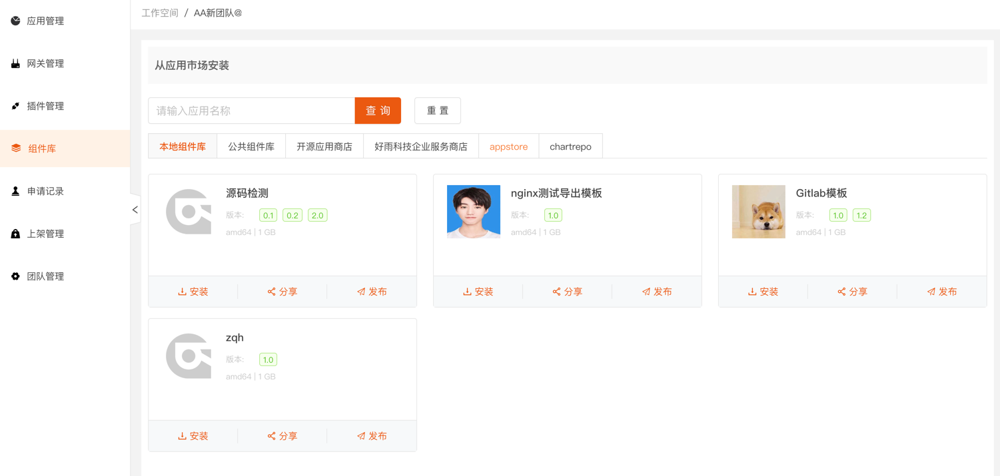

本篇文档介绍在 应用上云平台 中本地组件库的使用。

## 从应用市场安装

应用上云平台 提出了一种应用模型 应用上云平台 Application Model（RAM），这是标准的 应用上云平台 应用规范。基于该模型以及 应用上云平台 的应用市场机制，最终实现了一键安装/升级。高度自动化的交付体验，提升了企业应用交付效率，降低交付成本。

应用上云平台 提供的应用市场分为两类:

**1. 本地组件库**

:::info

本地组件库是 应用上云平台 自带的应用市场，你在这个企业下发布的所有应用模版都可以保存在此。企业内部的其他用户可以通过从本地组件库安装应用模版来快速复制这个应用。

:::

**2. 开源应用商店**

:::info

开源应用商店是由好雨科技官方支持的应用市场，所有 应用上云平台 都可以对接该市场，并一键安装上面的应用。

:::

本地组件库与云应用市场的区别主要在于: 你在本地组件库中发布的应用，只能在部署的这套 应用上云平台 环境中流转。而发布到云应用市场的应用，可以在多套 应用上云平台 环境中一键安装。

### 从本地组件库安装应用

当你部署完成 应用上云平台 后，你可以查看到组件库的应用，组件库分为本地组件库和公共组件库。本地组件库只在当前团队下可用。公共组件库需要审核，审核通过后，所有团队均可使用。

组件库的模版可以一键安装、分享和发布。

