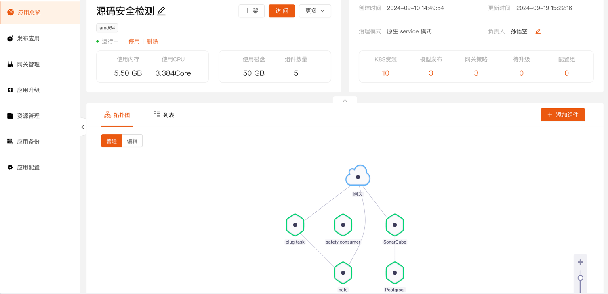
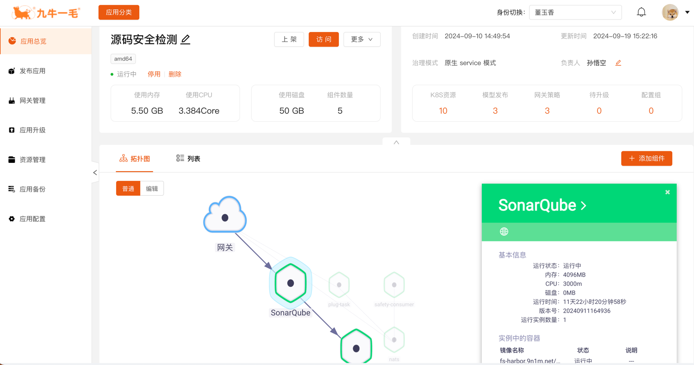

## 展示模式

拓扑图以图形化的方式展示应用的所有服务组件实时状态，它将展示如下几个维度的信息：

* 组件网络拓扑关系

图中可以清楚的展示组件直接的网络调用关系以及公网开放情况，结合流量状态可以便捷发现通信状态。

* 组件整体业务依赖关系

图中组件之间的连线表示组件业务依赖关系，让用户可以一看便知复杂业务系统的业务关系。

* 组件流量跟踪状态

拓扑图中的每条线在开通了性能分析插件后将实时呈现每条通信链路的吞吐率和响应时间，未来还会将错误率和分布式跟踪情况展现在链路中

* 组件运行状态

组件以颜色展示组件状态，对应关系如下：

| 颜色      | 未构建/未启动 |
| --------- | ------------- |
| 黑色/灰色 | 未构建/未启动 |
| 绿色      | 运行中        |
| 浅绿色    | 升级中        |
| 红色      | 已关闭        |

## 编辑模式

编辑拓扑图目前支持:服务组件连接建立或取消依赖关系、打开或关闭服务组件对外端口

* 删除动作

点击连接线按下 `delete` 键快速删除组件依赖关系、关闭服务组件所有对外端口

* 增加动作

点击起点焦点拖拽到终点即可建立两个组件间的依赖关系或打开外网访问。

## 拓扑图组件操作

用户可通过点击组件，在弹出的组件基础信息框内对组件进行访问，同时下方展示出了组件内的容器信息。

