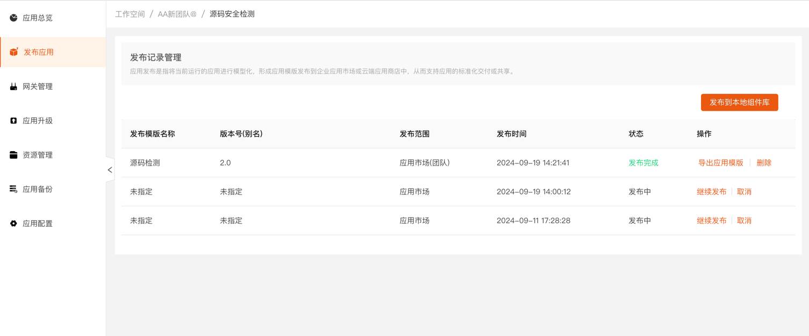

应用市场定义了支持大型分布式的数字化业务系统的标准云原生应用模型、它可以包含1-N个服务组件，模型包含其中每个服务组件资源及配置，插件资源及配置，拓扑关系、部署关系等。精心制作完成即可一键发布、一键安装。

在应用上云平台中，组件是应用上云平台可管理的最小服务单元，用户可以将多个组件组成一个复杂的业务系统，这套业务系统可以对外提供服务，也可以分享给其他组织独立部署，你可以将整套业务系统打包成一个 `云市应用` ，并选择将该应用发布到 `团队`、`公司`、`好雨公有云市` 。分享后的应用可供团队、公司或云市的用户一键安装部署完整的服务体系；分享到不同的范围，可见性也有所不同，具体可见范围如下：

* 团队：只有当前团队下的成员可见
* 公司：当前企业下的所有成员可见
* 云应用商店：连接好雨公有云应用商店的所有企业及用户可见

我们将一个 `应用` 内完整的业务解决方案集成体整体打包成一个 `云市应用` ，发布成功后，其他用户在创建应用时可以选择 `从应用市场安装` 的方式 `一键安装部署` 完整的服务体系，实现标准化的一键交付部署。

## 应用发布流程

**选择要分享的应用，点击`发布`**

> 提示：发布应用时，应用内所有组件的状态必须为运行中

**完善应用信息**

> 填写应用基本信息

* 应用模板：要发布的应用的模板
* 版本号：应用发布版本，当同一应用多次发布时，如果版本号相同，则会覆盖已发布的该版本应用，如果版本不同，将发布为新的版本。
* 版本别名：应用别名，例如 `高级版，初级版`
* 版本说明：应用的描述，便于使用者了解应用的作用。

> 填写每个组件的配置信息

* 环境变量：编辑该组件默认的环境变量，勾选 `可修改`，则其他用户安装此应用后可编辑这个环境的值，反之不可编辑。
* 伸缩规则：定义该组件可伸缩的最大最小节点数，及节点伸缩步长，最小安装内存限制。
* 连接信息：通常连接信息中会出现密码类的信息，应用上云平台提供了自动生成此类变量的值的功能可选。

> 发布插件模型信息 
 
要发布的应用当中其组件携带的插件

**提交发布任务**

完善应用信息后，点击 `提交`，发起同步任务。由集群对应用中的每一个服务进行数据同步。如果是发布到 `云应用商店` ，数据中心会将应用所需的镜像或源码包同步到好雨公有仓库，并将应用的模版数据保存到Console数据库并发送到好雨云应用商店保存。如果是发布到 `团队` 或 `公司`，则应用所需的镜像或源码包同步到本集群，并将应用的模版数据保存在Console数据库。

**确认发布**

当应用中的所有组件及插件全部完成同步后，点击 `确认发布`，即可完成应用发布。发布成功后可在 `团队视图` 下的 `组件库` 中对应的范围下看到你发布的应用。

**编辑应用发布信息**

发布到云端应用市场的应用，完成发布后会自动跳转到应用的展示页面，你需要登录云端市场后编辑应用的基础信息；或操作是否将此应用交付给其他应用上云平台用户。

